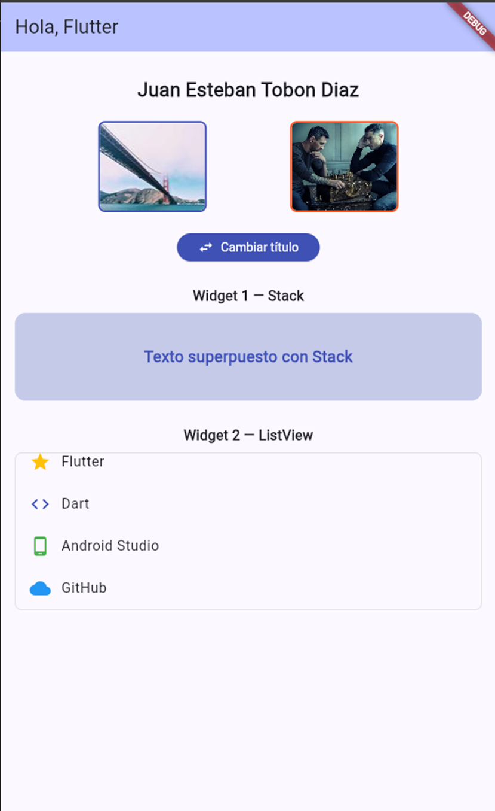
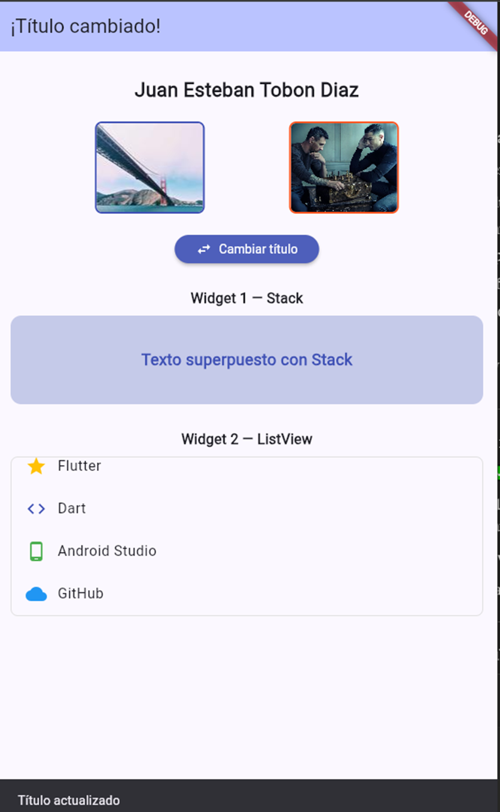

# Taller 1 — StatefulWidget y setState() en Flutter

## Descripción
Pantalla básica en Flutter que demuestra el uso de StatefulWidget y setState()
para actualizar la UI dinámicamente. Incluye cambio de título en AppBar,
SnackBar, imágenes con Image.network() e Image.asset(), Stack y ListView.

## Estudiante
- **Nombre completo:** Juan Esteban Tobon Diaz
- **Código:** 230222027

## Pasos para ejecutar

1. Clona el repositorio:
   git clone https://github.com/TOBON2109/resumidor-clases-ia.git

2. Entra al proyecto:
   cd resumidor-clases-ia/taller1

3. Instala dependencias:
   flutter pub get

4. Ejecuta la app:
   flutter run

## Capturas

## Rama
feature/taller1